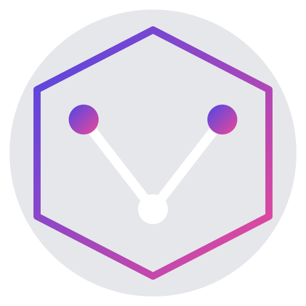

# Verifiable AI And Data Provenance


<div align="center">

  

  <h1>VeriFlow Network</h1>
  
  <h3>The Trust Layer for the AI Era</h3>

  <p>
    <b>Verifiable AI</b> • <b>Data Provenance</b> • <b>Decentralized Marketplace</b>
  </p>

  [](LICENSE)
  [](https://cosmos.network/)
  [](https://nextjs.org/)
  [](https://go.dev/)
  [](http://makeapullrequest.com)

  <br />

  <p>
    <a href="#-getting-started">Getting Started</a> •
    <a href="#-monorepo-architecture">Architecture</a> •
    <a href="#-roadmap">Roadmap</a> •
    <a href="#-contributing">Contributing</a>
  </p>

</div>

---

## 🌟 The Mission

**VeriFlow Network** is a sovereign Layer 1 Blockchain dedicated to solving the "Black Box" problem in Artificial Intelligence.

In an era flooded with Deepfakes and unverified data scraping, VeriFlow acts as the immutable registry for data ownership and model verification.

| The Problem ❌ | VeriFlow Solution ✅ |
| :--- | :--- |
| **Unverified Data** used in AI training. | **On-Chain Provenance:** Every dataset gets a cryptographic hash & timestamp. |
| **Creators Unpaid** for their IP. | **Royalty Stream:** Smart contracts pay creators automatically when data is used. |
| **Black Box AI** decision making. | **Audit Trails:** Transparent history of what data trained which model. |

---

## 🛠️ Tech Stack

We combine the power of **Golang** for the blockchain layer with the flexibility of **TypeScript** for the application layer.

### Blockchain Layer (Layer 1)


### Application Layer (Frontend & Middleware)


---

## 🏗️ Monorepo Architecture

This repository is a Monorepo designed for full-stack Web3 development.

```bash
veriflow-network/
├── 📂 chain/             # ⚙️ THE ENGINE (Layer 1)
│   ├── x/provenance/     # Custom module for registering Data Assets
│   └── x/marketplace/    # Custom module for buying/selling Data
│
├── 📂 web/               # 🖥️ THE FACE (Frontend)
│   ├── src/app           # Next.js 14 App Router
│   ├── hooks/            # React Hooks for Keplr Wallet
│   └── components/       # UI Components (Tailwind)
│
├── 📂 indexer/           # 🔍 THE BRIDGE (Middleware)
│   └── ...               # Node.js service to index chain events to MongoDB
│
└── 📂 ts-client/         # 🌉 THE CONNECTOR
                          # Auto-generated Typescript client to talk to the chain
```

---

## 🚀 Getting Started

Follow these steps to run the entire ecosystem on your local machine.

### 0. Prerequisites
*   [Go](https://go.dev/) (v1.21+)
*   [Node.js](https://nodejs.org/) (v18+)
*   [Ignite CLI](https://ignite.com/cli)
*   [Keplr Wallet Extension](https://www.keplr.app/)

### 1. Start the Blockchain
Navigate to the `chain` directory and ignite the chain.

```bash
curl https://get.ignite.com/cli! | bash
cd chain
ignite scaffold chain verichain
ignite scaffold list dataset dataHash:string owner:string price:uint description:string --module provenance
ignite chain serve
```
> 🟢 **Status:** The blockchain API is now running at `localhost:1317` and RPC at `localhost:26657`.

### 2. Start the Frontend
Open a new terminal tab.

```bash
cd web
npm install @cosmjs/stargate @cosmjs/proto-signing
npm install
npm run dev
```
> 🟢 **Status:** Open `http://localhost:3000` to see the User Interface.

---

## 🗺️ Roadmap

Our journey to decentralized AI.

- [x] **Phase 1: Genesis**
    - [x] Initialize Chain with Ignite CLI.
    - [x] Create basic `x/provenance` module (CRUD).
- [ ] **Phase 2: Integration**
    - [ ] Connect Frontend with Keplr Wallet.
    - [ ] Implement IPFS / Arweave storage handler.
    - [ ] Mint "Data-NFT" logic.
- [ ] **Phase 3: Marketplace**
    - [ ] Build `x/marketplace` module.
    - [ ] Enable token transfers for data access.
- [ ] **Phase 4: Mainnet**
    - [ ] Incentivized Testnet.
    - [ ] IBC Connection to Osmosis/Cosmos Hub.

---

## 🤝 Contributing

We heavily rely on the community to build this future. Whether you are a **Node.js Wizard** 🧙‍♂️ or a **Golang Gopher** 🐹, we need you!

1.  **Fork** the repository.
2.  Create a new branch (`git checkout -b feature/amazing-feature`).
3.  Commit your changes (`git commit -m 'Add some amazing feature'`).
4.  Push to the branch (`git push origin feature/amazing-feature`).
5.  Open a **Pull Request**.

See [CONTRIBUTING.md](CONTRIBUTING.md) for code standards.

---

## 📄 License

Distributed under the MIT License. See `LICENSE` for more information.

---

<div align="center">
  <sub>Built with ❤️ by the Dencuan Team.</sub>
</div>
```
